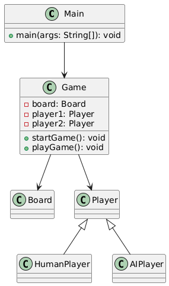

# TicTacToe Game (Гра "Хрестики-нулики")

## Огляд
Це класична гра "Хрестики-нулики", реалізована на мові Java. Гравці можуть вибрати:
- Грати проти іншого гравця.
- Грати проти комп'ютера (три рівні складності: Легкий, Середній, Складний).

## Функціонал
1. **Режим гравець проти гравця (Player vs Player)**:
    - Два гравці можуть грати на одному пристрої.
2. **Режим гравець проти комп'ютера (Player vs Computer)**:
    - Легкий: Комп'ютер прогнозує лише один крок вперед.
    - Середній: Комп'ютер прогнозує три кроки вперед.
    - Складний: Комп'ютер використовує повний алгоритм Minimax для оптимальних ходів.
3. Динамічне відображення ігрового поля.
4. Модульний дизайн із використанням принципів об'єктно-орієнтованого програмування.

---

## Як запустити
1. Переконайтеся, що Java встановлена (версія 8 або новіша).
2. Скомпілюйте та запустіть файл `Main.java`:
   ```bash
   javac TicTacToe/Main.java
   java TicTacToe.Main

## UML діаграма

